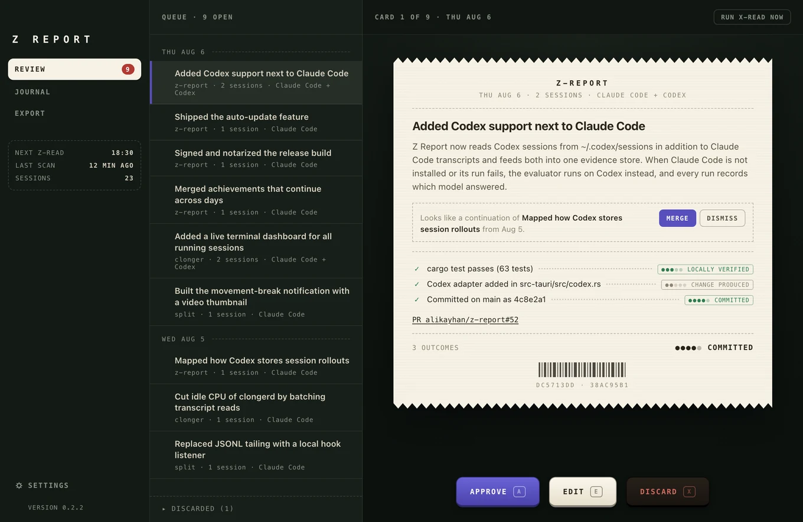

<p align="center">
  
</p>

<h1 align="center">Z Report</h1>

<p align="center"><em>It celebrates outcomes, not activity. No tracking, no scoring, no dashboards.</em></p>

A fully local macOS app that turns your Claude Code and Codex sessions into a private,
evidence-backed journal of what you accomplished. Like the Z-report a cash register prints
at closing time, it totals what was actually recorded: each evening it reconstructs
achievements from local transcripts and Git history, and you approve, edit, merge, or
discard them.

<p align="center">
  
</p>

## Install

Requires an Apple Silicon Mac on macOS 13 or newer, and the
[Claude Code](https://code.claude.com/docs/en/quickstart) or
[Codex](https://github.com/openai/codex) CLI installed and signed in.

```sh
brew install --cask alikayhan/tap/z-report
```

Or download the DMG from the [latest release](https://github.com/alikayhan/z-report/releases/latest).
Releases are signed, notarized, and update in place after you confirm.

## How it works

1. **Work normally.** Every 30 minutes the app scans local transcripts for facts (prompts,
   changed files, commands and their exit status, pull requests) and matches them with
   your Git history. Work delegated to sub-agents counts as yours.
2. **Z-read.** At the time you choose, the day's sessions are evaluated by your own Claude
   Code account, falling back to Codex. The first run backfills about two weeks.
3. **Confirm.** Review each card by click or keyboard (J/K, A approve, E edit, X discard).
   Work that spans several days is flagged as a merge suggestion. Nothing enters the
   journal without you.
4. **Export.** Copy or save daily, weekly, or custom-range Markdown for standups, weekly
   updates, or performance reviews.

## Evidence levels

Every claim is labeled with the highest level local facts support. The check is
deterministic Rust code, not the model, and it downgrades anything the evaluator overstated.

| Level | Meaning |
| --- | --- |
| Work observed | The session shows investigation or implementation |
| Change produced | A concrete change exists, in the repository or outside it |
| Locally verified | A relevant test, build, or check passed |
| Committed | The change is in a local commit, or a pull request was recorded |
| Impact confirmed | You confirmed a real-world outcome yourself |

## Privacy

All data lives in `~/Library/Application Support/com.alikayhan.zreport/` as SQLite. There is
no account, backend, analytics, or telemetry. Only two things leave your Mac:

- the evidence package for each evaluation, sent to Anthropic or OpenAI through your own
  Claude Code or Codex account. Full transcripts are never copied, and prompt excerpts can
  be turned off in Settings.
- a daily check with GitHub for the latest release, carrying nothing about you or your work.

The evaluator runs sandboxed: read-only tools, an ephemeral session, and a working
directory holding only the evidence package.

## Claude Code mod

`/z-report` opens the same review queue and journal in a Claude Code pane. It needs Claude
Code 2.1.273 or newer with `CLAUDE_CODE_ENABLE_FUNCTION_HOOKS=1` set, and, if you also use
the desktop app, Z Report 0.2.3 or later opened once.

```sh
claude plugin marketplace add alikayhan/z-report
claude plugin install z-report@z-report
```

If you added the archived `alikayhan/z-report-releases` marketplace before 0.3.0, run
`claude plugin marketplace remove z-report` first.

## Development

Requires Rust (stable), Node 20+, and the Claude Code or Codex CLI.

```sh
npm install
npm run tauri dev      # run the app
npm run dev            # UI only, in a browser against fixture data (src/mock.ts)
cargo test --workspace # backend tests
npm run mod:test       # engine tests plus the CLI integration suite
npm run mod:check      # mod type check and hook tests
npm run mod:package    # signed plugin and local marketplace, under dist/claude-code-mod/
```

- [Releasing](docs/releasing.md): versioning, the release workflow, and required secrets
- [CLI and transcript contracts](docs/cli-contracts.md): what the app relies on from
  Claude Code and Codex, and the versions it was verified against

## License

[MIT](LICENSE).
