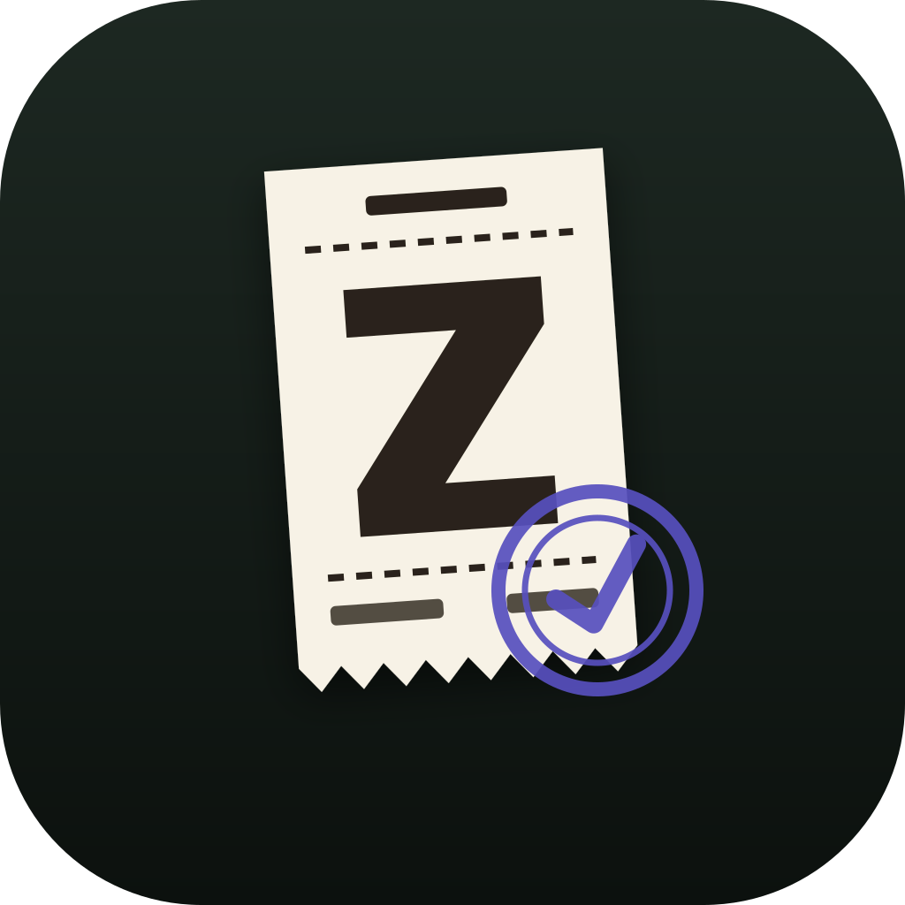

<p align="center">
  
</p>

<h1 align="center">Z Report</h1>

<p align="center"><em>It celebrates outcomes, not activity. No tracking, no scoring, no dashboards.</em></p>

A fully local macOS app that turns work done with Claude Code and Codex into a
private, evidence-backed record of achievements. It opens as a regular desktop window and
keeps a menu-bar icon; closing the window leaves it collecting evidence and running
the evening Z-read in the background. Like the end-of-day Z-report a cash register
prints, it totals what was actually recorded and closes the books on the day: each
evening it reconstructs accomplishments from local session transcripts and Git facts,
then asks you to approve, edit, merge, or discard them. The same journal can also be
reviewed without leaving Claude Code, through the optional [Claude Code mod](#claude-code-mod).

## How it works

```
macOS desktop window + menu-bar tray (Tauri)   |   Claude Code mod (/z-report)
        ↓                                      |           ↓
background worker + scheduler (Rust)           |   z-report engine CLI
        └──────────── shared engine (Rust) ────────────────┘
        ↓
transcript adapters (Claude Code ~/.claude/projects, Codex ~/.codex/sessions) + Git evidence adapter
        ↓
normalized local evidence store (SQLite)
        ↓
constrained evaluator (claude -p, Opus 5.5, high; falls back to codex exec, GPT-6.1 Sol, high)
        ↓
review queue → approved journal → Markdown export
```

Daily flow:

1. **Work normally.** Every 30 minutes (configurable) the worker scans local Claude
   Code and Codex transcripts, extracts facts (prompts, files changed, commands run,
   exit status, pull requests opened, external tools used to change something), and
   correlates them with local Git state (repo, branch, your commits). Work you
   delegated to a sub-session counts too. Both tools feed one evidence store, so a
   task started in Codex and finished in Claude Code arrives as one card when the
   sessions share a day, and as a merge suggestion when they do not.
2. **Z-read.** At your chosen time a notification announces the day's candidates
   ("3 achievements are ready"). "Review now" runs a mid-day X-read on demand. Either
   one evaluates every session from the last 15 days it hasn't evaluated yet, one
   evaluator run per day, so a first run backfills about two weeks of work. The
   evaluator runs on Claude Code; when Claude Code is not installed or its run fails,
   the same evidence goes to Codex instead, and each run records which model answered.
3. **Confirm.** Approve, edit, merge, or discard each candidate — by click or with
   the keyboard (J/K moves through the queue, A approves, E edits, X discards).
   Cards that look like two halves of the same work say so, with the merge one
   click away. Nothing enters the journal without you, and nothing merges without
   you either.
4. **Export.** Copy or save daily/weekly/custom-range Markdown summaries for
   standups, weekly updates, or performance reviews.

## Evidence levels

Every claim carries the highest level local facts support, and the verifier
downgrades anything the evaluator overstated:

1. **Work observed** — investigation or implementation appears in a session
2. **Change produced** — a concrete change exists, in the repo or outside it
3. **Locally verified** — a relevant test/build/check passed
4. **Committed** — the change exists in a local commit, or the session recorded a
   pull request alongside a file change
5. **Impact confirmed** — you manually confirmed a real-world outcome

Verification is deterministic Rust code, not the model: commit refs are checked with
`git cat-file`, command refs against recorded exit status, file refs against the
session's change list, and pull request refs against links recorded in the session
itself. Unsupported claims are downgraded and labeled.

A recorded pull request proves the change was proposed, not that it merged — merge
state is not knowable offline, so it never reaches level 5 on its own. It does keep an
achievement at level 4 after a squash merge deletes the local commit. Links are carried
through to the journal and Markdown export, and only canonical `github.com` pull request
URLs are kept.

Not all work lands in the repository. When a session used a connected tool to change
something outside it — commenting on a ticket, updating a document — that call is
recorded as an external action and cited like any other fact. It stops at level 2: the
call is known to have succeeded, but nothing on your Mac can confirm what it did, so the
evaluator describes it as performed rather than as impact. Only calls that write are
cited; searches, fetches, and screenshots are how the work got done, not what it
produced. Nothing in a transcript says which is which, so it is inferred from the tool
name and recorded alongside the call — a sharper guess later can reclassify calls
already read, rather than being unable to recover what an earlier filter discarded.

A session that delegates work to a sub-session is credited with it: the edits and
commands from the delegated run fold into the parent session and carry the same evidence
weight, since you directed them. They are marked as delegated so the evaluator describes
them accurately rather than as hands-on work, and so a delegated session is no longer
mistaken for an empty one. Only the parent's prompts count as things you said, and only
the parent's working directory defines the repository — a delegate may run in its own
worktree.

## Work carried across days

An evaluation covers one day at a time, so a task you picked up on Tuesday and finished
on Wednesday used to arrive as two cards that never saw each other. Z Report now scores
each new card against the recent queue and the journal, and marks the ones that look like
one piece of work.

The signal that carries this is the session's own title: the name the tool gave it (Claude
Code generates one from how the session opened; Codex names threads only in its desktop
app), or the opening prompt when there is no name. Either way it is a statement of what you set out to do, so two
sessions on one thread tend to share wording even when the finished cards do not — the
evaluator rewrites each day's card in outcome-first language, which erases the overlap
between them. Matching requires the same repository and title wording in common; shared
files and a shared feature branch only strengthen a match that already exists. They
cannot create one, because the earlier half of a thread is usually a scoping session that
changed no files at all, and a rename-everything session would otherwise look related to
everything in its repo. Branches every session shares, like `main`, count for nothing.

Nothing merges on its own. A match is a suggestion on the card with the work that
continues it, and dismissing one is remembered against the sessions involved, so it stays
dismissed even after that day is evaluated again. Merging is still the same manual path
it always was. A merged achievement spans from the day the work started to the day it
finished, and appears in any export whose range overlaps it rather than falling through
the gap at either end. Its outcomes are carried across untouched so verified evidence
survives; only the prose is rewritten, in the background, and if that rewrite fails the
merged card simply keeps its assembled text.

Work already approved into the journal is flagged rather than hidden: if a session you
have already written up comes back through evaluation, the new card says so and links to
the entry, instead of quietly appearing as a second copy of something you have read.

## Claude Code mod

`/z-report` opens the review queue in a Claude Code pane: approve, edit, merge, discard,
search the journal, and export, against the same local store the desktop app uses.
`/z-report x-read` starts a read and `/z-report cancel` stops it. Inside the pane, Tab
moves between controls, Enter picks, Escape returns to the prompt and Close dismisses the
pane. A read in either client shows as running in the other, and edits carry a revision
so a card changed in one place cannot be silently overwritten from the other. With
"Catch up in Claude Code after 24 hours" on (Settings), an interactive session runs a
read by itself once a day has passed without one.

The mod bundles its own copy of the engine and needs:

- macOS on Apple Silicon
- Claude Code 2.1.273 or newer. The mod checks this before touching the journal. It was
  tested against 2.1.273 through 2.1.287; the function-hooks API is early access and may
  change without notice, so newer releases are accepted but not guaranteed
- `CLAUDE_CODE_ENABLE_FUNCTION_HOOKS=1` in the environment
- if you already use the desktop app, Z Report 0.2.3 or later, opened once. Only the
  desktop app upgrades an existing journal, so an older app is never locked out of it

Released builds install from the public marketplace in
[z-report-releases](https://github.com/alikayhan/z-report-releases):

```sh
claude plugin marketplace add alikayhan/z-report-releases
claude plugin install z-report@z-report
```

To install from a checkout instead:

```sh
npm run mod:package
claude plugin marketplace add ./dist/claude-code-mod/marketplace
claude plugin install z-report@z-report
```

## Privacy and network boundary

- All product data (evidence, candidates, journal, settings) lives in
  `~/Library/Application Support/com.alikayhan.zreport/` — SQLite, no accounts, no sync.
- Z Report has **no backend, no analytics, and no telemetry**.
- Two things leave your Mac, and nothing else:
  1. Each evaluation runs on **your own Claude Code account**, or on your Codex account
     when Claude Code is not installed or its run fails, sending the prepared evidence
     package (session excerpts from both Claude Code and Codex, file paths, command
     results including those from delegated sub-sessions, the names of external tools
     used to change something, commit and pull request metadata) to Anthropic, or to
     OpenAI for a Codex run — the same boundary as using that tool itself. Transcripts
     from either tool are only ever read locally. This is disclosed in Settings.
     Arguments passed to external tools are never included, only the server and tool
     name.
  2. The updater asks GitHub for the latest release metadata about once a day.
     The request carries nothing about you or your work, and updates only install with
     your confirmation — never while an evaluation is running.
- The evaluator is sandboxed: fresh ephemeral run, read-only tools (Claude Code:
  `Read,Grep,Glob`; Codex: `--sandbox read-only`), working directory containing only
  the evidence package, no session persistence, no user settings, and on Claude Code an
  optional per-run safety cap.
- Prompt excerpts in evidence are optional (Settings → Privacy). Full transcripts
  are never copied — only referenced. The retention setting governs the review queue:
  unreviewed candidates age out, approved entries stay. Extracted session facts are
  kept for 90 days, and dropped once their transcript is gone. "Delete all data"
  erases everything.

## Development

Requirements: Rust (stable), Node 20+, and the Claude Code or Codex CLI installed and
authenticated (Claude Code is preferred; Codex is the fallback).

```sh
npm install
npm run tauri dev      # run the app
cargo test --workspace # backend tests
npm run tauri build    # release bundle (.app + .dmg), under target/
npm run mod:test       # engine tests plus the CLI integration suite
npm run mod:check      # mod type check and hook tests
npm run mod:package    # signed plugin and local marketplace, under dist/claude-code-mod/
```

The UI can be developed without Tauri: `npm run dev` serves it in a browser against
fixture data (`src/mock.ts`).

## Releasing

The version lives in `src-tauri/Cargo.toml`, `crates/z-report-core/Cargo.toml`,
`crates/z-report-cli/Cargo.toml`, and `mods/claude-code/.claude-plugin/plugin.json`;
packaging fails unless all four match, and the release workflow fails unless the pushed
tag matches `src-tauri/Cargo.toml`. `package.json` and `tauri.conf.json` deliberately
carry none. Bump the version, run `cargo check` so `Cargo.lock` follows, then tag:

```sh
git tag -a v0.2.0 -m "What changed, published as the release notes"
git push origin v0.2.0
```

The tag triggers `.github/workflows/release.yml`, which tests, builds
`aarch64-apple-darwin`, signs, notarizes, and staples the app and DMG, and publishes the
DMG, updater archive (`.app.tar.gz` + `.sig`), the notarized Claude Code mod archive,
`latest.json`, and `checksums.txt` to the
public [z-report-releases](https://github.com/alikayhan/z-report-releases) repository,
then rewrites that repository's `.claude-plugin/marketplace.json` to point at the new mod
archive. Installed apps discover the release through `latest.json`, and the mod through
the marketplace. Homebrew users get it once `Casks/z-report.rb` in
[homebrew-tap](https://github.com/alikayhan/homebrew-tap) is bumped; the workflow's run
summary includes a paste-ready Cask rendered from `packaging/homebrew/` with the new
version and DMG SHA-256 filled in.

Required GitHub Actions secrets:

| Secret | Contents |
| --- | --- |
| `APPLE_CERTIFICATE` | Developer ID Application certificate, base64-encoded `.p12` |
| `APPLE_CERTIFICATE_PASSWORD` | Password of the `.p12` |
| `APPLE_SIGNING_IDENTITY` | e.g. `Developer ID Application: Name (TEAMID)` |
| `APPLE_API_ISSUER` | App Store Connect API issuer ID |
| `APPLE_API_KEY` | App Store Connect API key ID |
| `APPLE_API_KEY_CONTENT` | Contents of the App Store Connect `AuthKey_*.p8` file |
| `TAURI_SIGNING_PRIVATE_KEY` | Contents of `~/.tauri/z-report.key` |
| `TAURI_SIGNING_PRIVATE_KEY_PASSWORD` | Its password (empty if none) |
| `RELEASE_REPO_TOKEN` | Fine-grained PAT with contents write on `z-report-releases` |

The updater private key exists only in `~/.tauri/z-report.key` and the CI secret. Back it
up somewhere durable: shipped apps embed the public key and will reject updates signed by
any other key, so losing it strands every installed copy on its current version.

## Evaluator contract (validated)

Verified against Claude Code 2.1.215:

- `claude -p --model claude-opus-5-5 --effort high --output-format json` returns a
  single JSON result whose `modelUsage` records the model that actually served the
  run — stored with every evaluation.
- `--json-schema` yields a validated `structured_output` object matching the
  achievement contract (no output parsing heuristics).
- `--tools "Read,Grep,Glob" --disallowedTools ... --no-session-persistence
  --setting-sources ""` provide read-only, ephemeral isolation; `--max-budget-usd`
  adds a fixed per-run safety cap when the cost limit is enabled. Permission denials
  are visible in the result.

Verified against Codex CLI 0.152.1:

- `codex exec --model gpt-6.1-sol -c model_reasoning_effort="high" --output-schema
  <file> -o <file> --json` writes the schema-checked answer to the `-o` file and streams
  typed events (`thread.started`, `item.completed`, `turn.completed` with token usage)
  to stdout. No event names the serving model, so the requested model is recorded.
- The schema must be strict for OpenAI structured outputs: every object closed with
  `additionalProperties: false` and every property required. The same schema is handed
  to both CLIs.
- `--sandbox read-only -c approval_policy="never" --ephemeral --ignore-user-config
  --skip-git-repo-check` provide read-only, ephemeral isolation: no rollout is written
  (so the run never shows up as a Codex session of its own), and the developer's MCP
  servers, hooks, and reviewer settings are not loaded. Auth still comes from
  `~/.codex`.
- `codex exec` waits on stdin when it is not a terminal, so stdin is closed explicitly.
  `codex login status` reports the auth method in prose ("Logged in using ChatGPT");
  an API-key login is treated as metered.
- There is no per-run budget flag, so the cost limit setting applies to Claude Code only.
- Fallback order is fixed: Claude Code runs when its CLI is found; Codex runs when it is
  not, or when the Claude Code run returns any error. A run that fell back keeps the
  Claude Code failure as its note, and the model column names the CLI that answered.
  There is no setting for this.
- Transcript JSONL records are typed (`user`, `assistant`, `system`, `pr-link`,
  `ai-title`, attachments, snapshots); parsing is defensive because the schema is
  internal to Claude Code and undocumented. Records carry `cwd`, `gitBranch`,
  `version`, and timestamps used for Git correlation.
- `ai-title` is emitted repeatedly through a session but never revised: across a
  20-session sample every session carried exactly one distinct title, re-emitted up to
  98 times. It describes the opening of the session, not its conclusion.
- Connected-tool calls appear as `tool_use` blocks named `mcp__<server>__<tool>`, paired
  with a `tool_result` the same way shell commands are. No field in the record — and no
  cached server manifest — states whether a call is read-only, so the tool name is the
  only local signal.
- Delegated runs live in sibling files (`<session-id>/subagents/agent-*.jsonl`) whose
  records are flagged `isSidechain`. They are read alongside the parent transcript and
  folded into the same session, and they contribute to the change-detection hash so
  delegated work alone re-triggers an evaluation.

## Codex transcript contract (validated)

Verified against Codex CLI and desktop 0.147 through 0.153. Older rollouts use several
earlier record shapes and are not read.

- One rollout per thread at `~/.codex/sessions/YYYY/MM/DD/rollout-<time>-<uuid>.jsonl`,
  plus `~/.codex/archived_sessions/`. The uuid is the session id. Every line carries a
  top-level `timestamp`, `type`, and `payload`.
- The first record is `session_meta` with `id`, `cwd`, `cli_version`, `originator`,
  `source`, and a `git` block whose `branch` is used when present. Each turn repeats
  `cwd` in a `turn_context` record. A resumed thread appends to the same file; a forked
  thread copies only the parent's metadata, under the parent's id, so metadata is taken
  only from records matching the file's own id.
- Facts arrive as `event_msg` records of type `item_completed`, keyed by `item.type`:
  `UserMessage` (prompts, already free of injected context), `AgentMessage` with
  `phase: final_answer` (final response), `CommandExecution` (`command` array, numeric
  `exit_code`, `status`), `FileChange` (`changes` keyed by absolute path with `add`,
  `update`, or `delete`), and `McpToolCall` (`server`, `tool`, `readOnlyHint`, `status`,
  `result.isError`). The read-only hint decides mutability when it is a boolean; the
  tool-name heuristic is the fallback.
- Spawned sub-agents are separate rollouts carrying `parent_thread_id`; they fold into
  the parent as delegated work, transitively. Threads whose `source` is a subagent of
  kind `other` are approval reviewers that quote the parent's transcript as their prompt
  and are skipped entirely.
- Desktop threads are named in `~/.codex/session_index.jsonl` (`id`, `thread_name`); the
  name is the session title. CLI threads have no name and, like any unnamed session, use
  the opening prompt unless prompt retention is off, in which case they carry no title.
- Codex records no pull-request link, so level 4 for a Codex session rests on local
  commits.

## Non-goals (MVP)

Cloud sync, accounts, coding agents other than Claude Code and Codex, Slack/ticketing/GitHub API integrations,
manager analytics, time/token reporting, monetary estimates, automatic publishing,
cross-platform support.
